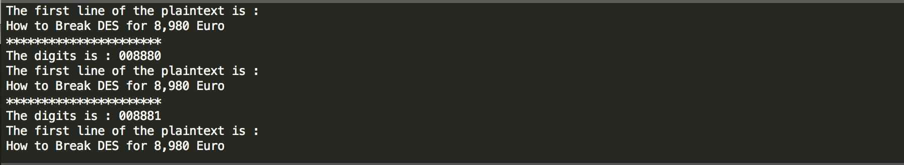
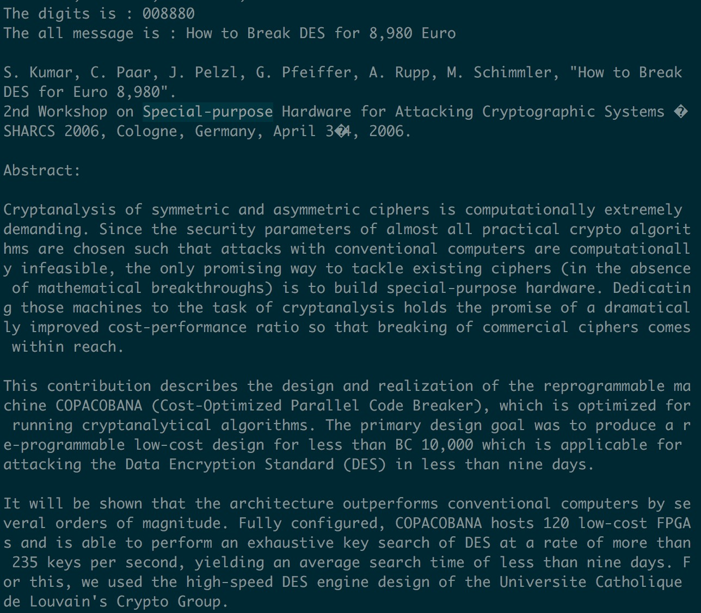
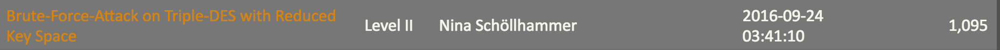

题目链接：https://www.mysterytwisterc3.org/en/challenges/level-ii/hybrid-encryption-i

主要思路：通过3DES的方式进行解密，通过题目中的提示得知前面的字母为'COPACOBANA'，再通过burp函数对后面的6bytes数字进行爆破。

具体结果可看目录下文件test.txt
结果：
跑出全部可行的数(这个是由于题目的原因可以用)

仅跑出一个数

验证结果：

